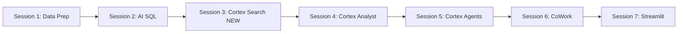

# Plan: Sun Life Capital HOL

## Context

**Source repo:** `https://github.com/sfc-gh-cleblanc/cortex-hol`

The existing HOL is a 6-session Streamlit guide for a dental claims insurance scenario (DentaQuest). It ships with:
- 6 structured CSV tables: `members`, `claims`, `providers`, `dental_procedures`, `claim_notes`, `member_communications`
- 15 unstructured documents (8 PDFs + 7 TXTs): dental EOBs, clinical narratives, appeal letters
- Session flow: Data Prep → AI SQL → Cortex Analyst → Cortex Agents → CoWork → Streamlit

**Target:** Retarget to Sun Life Capital (asset and position management), insert a Cortex Search session after AI SQL, and rework AI SQL to parse/classify/chunk investment PDFs for that search service.

---

## New Session Structure



Sessions 3-6 in the original become Sessions 4-7.

---

## Domain Mapping

| Original (Dental) | New (Capital Management) |
|---|---|
| Database `DENTAL_CLAIMS_AI` | `SUN_LIFE_CAPITAL_AI` |
| Schema `CLAIMS_ANALYTICS` | `PORTFOLIO_ANALYTICS` |
| Warehouse `CLAIMS_WH` | `CAPITAL_WH` |
| Stage `CLAIM_DOCS` | `INVESTMENT_DOCS` |
| `MEMBERS` | `CLIENTS` |
| `CLAIMS` | `POSITIONS` |
| `PROVIDERS` | `SECURITIES` |
| `DENTAL_PROCEDURES` | `ASSET_CLASSES` |
| `CLAIM_NOTES` | `ANALYST_NOTES` |
| `MEMBER_COMMUNICATIONS` | `CLIENT_COMMUNICATIONS` |
| `EXTRACTED_CLAIM_INSIGHTS` | `EXTRACTED_INVESTMENT_INSIGHTS` |
| _(none)_ | `DOCUMENT_CHUNKS` (new — for Cortex Search) |
| `CLAIMS_ANALYTICS_VIEW` | `PORTFOLIO_ANALYTICS_VIEW` |
| `CLAIMS_ANALYST_AGENT` | `PORTFOLIO_ANALYST_AGENT` |
| `CLAIMS_DASHBOARD` | `PORTFOLIO_DASHBOARD` |
| Dental claim documents | Investment research reports and memos |

---

## Implementation Steps

### Task 1 — Clone repo and set up directory structure

```bash
git clone https://github.com/sfc-gh-cleblanc/cortex-hol.git .
```

The working directory is `/Users/craigleblanc/CortexCode/SLC_Cortex_HOL`. After cloning, the layout is:
```
workshop_guide/
  app_pages/         ← session_01.py … session_06.py (will become 01-07)
  data/              ← CSVs + claim_documents/
  static/            ← fonts, logos
  components.py
  streamlit_app.py
```

Create `workshop_guide/data/investment_documents/` to hold the new document files. Rename/delete `data/claim_documents/`.

---

### Task 2 — Generate capital management CSV data files

Replace the 6 existing CSVs. Each needs ~100–500 rows of realistic synthetic data.

**`clients.csv`** (~200 rows)  
`CLIENT_ID, ACCOUNT_NUMBER, NAME, ACCOUNT_TYPE, RISK_PROFILE, PORTFOLIO_VALUE, ADVISOR_ID, PROVINCE, INCEPTION_DATE`  
Account types: Pension, RRSP, RRIF, TFSA, Institutional, Non-Registered

**`positions.csv`** (~500 rows)  
`POSITION_ID, CLIENT_ID, SECURITY_ID, QUANTITY, MARKET_VALUE, COST_BASIS, UNREALIZED_GAIN_LOSS, ASSET_CLASS, CURRENCY, AS_OF_DATE, STATUS`  
Status: Active, Pending Settlement, Closed

**`securities.csv`** (~50 rows)  
`SECURITY_ID, TICKER, NAME, ASSET_CLASS, SECTOR, EXCHANGE, CURRENCY, COUNTRY, BETA, DIVIDEND_YIELD`

**`asset_classes.csv`** (~15 rows)  
`ASSET_CLASS_ID, NAME, DESCRIPTION, RISK_LEVEL, BENCHMARK, TARGET_ALLOCATION_PCT`  
Classes: Canadian Equity, US Equity, International Equity, Fixed Income, Real Estate, Infrastructure, Cash, Alternatives

**`analyst_notes.csv`** (~200 rows)  
`NOTE_ID, SECURITY_ID, ANALYST_NAME, NOTE_TEXT, NOTE_DATE, RECOMMENDATION, SENTIMENT`  
Free-text entries: price target revisions, earnings commentary, risk flag notes

**`client_communications.csv`** (~100 rows)  
`COMM_ID, CLIENT_ID, CHANNEL, SUBJECT, BODY, COMM_DATE, COMM_TYPE`  
Types: Portfolio Review Request, Risk Inquiry, Withdrawal Request, Rebalancing Discussion

---

### Task 3 — Generate investment document files

Replace `claim_documents/` with `investment_documents/` containing 15 files that represent realistic capital management documents. These need enough text content for Cortex Search to return meaningful results.

**8 PDF-format files** (stored as `.pdf` with text content; use Python `fpdf2` or `reportlab` to generate during setup, or supply as pre-generated files):

| File | Type | Content |
|------|------|---------|
| `research_report_canadian_banks.pdf` | Research Report | Analysis of Royal Bank, TD, BNS; buy/hold/sell ratings |
| `research_report_tech_sector.pdf` | Research Report | US technology sector outlook; AI infrastructure thesis |
| `fund_prospectus_global_equity.pdf` | Fund Prospectus | Investment objectives, risk factors, fees for a global equity fund |
| `fund_prospectus_fixed_income.pdf` | Fund Prospectus | Canadian bond fund details, duration risk, credit quality |
| `quarterly_report_Q1_2025.pdf` | Quarterly Report | Portfolio performance summary, attribution, market commentary |
| `quarterly_report_Q4_2024.pdf` | Quarterly Report | Year-end review, asset allocation shifts, outlook |
| `investment_memo_infrastructure.pdf` | Investment Memo | Thesis for Canadian infrastructure allocation increase |
| `investment_memo_real_estate.pdf` | Investment Memo | REIT sector analysis, rising rate impact assessment |

**7 TXT files:**

| File | Type | Content |
|------|------|---------|
| `market_commentary_jan2025.txt` | Market Commentary | Interest rate environment, equity risk premium |
| `market_commentary_feb2025.txt` | Market Commentary | Inflation data, BoC rate decision impact |
| `risk_assessment_equity_overweight.txt` | Risk Assessment | Concentration risk note for equity-heavy portfolios |
| `risk_assessment_fx_exposure.txt` | Risk Assessment | USD/CAD hedging review for unhedged US positions |
| `portfolio_rebalancing_note.txt` | Rebalancing Note | Trigger analysis, band breaches, rebalancing trades |
| `esg_screening_update.txt` | ESG | ESG criteria updates, excluded securities list |
| `compliance_note_restricted_list.txt` | Compliance | Restricted trading list update, blackout periods |

---

### Task 4 — Update app shell files

**`workshop_guide/streamlit_app.py`**
- `page_title` → `"Capital Management AI Workshop"`
- `page_icon` → `:material/trending_up:`
- Navigation: add Session 3 "Cortex Search" between AI SQL and Cortex Analyst; shift sessions 3-6 → 4-7
- Sidebar block labels: "Block 1: Data & Intelligence" (sessions 1-4), "Block 2: Agents & Apps" (sessions 5-7)
- `components.py` `SESSION_PROMPTS`: add entry for session 3 (prompt IDs "3.1", "3.2") and update prompts for sessions 2, 4-7 accordingly; session 2 prompt IDs become "2.1", "2.2", "2.3", "2.4"

**`workshop_guide/app_pages/home.py`**
- Title → `"Capital Management AI Workshop"`
- Subtitle → `"Building Intelligence for Portfolio Analytics with Snowflake Cortex"`
- Scenario: Sun Life Capital manages pension and investment accounts; portfolio managers need to analyse positions, extract insights from investment research documents, and surface risk and opportunity signals
- What we're building: same 6-step structure but capital management domain
- Table showing structured (positions, clients, securities) vs unstructured (research reports, memos, compliance docs) vs reference (asset classes) data

**`workshop_guide/app_pages/agenda.py`**
- Insert Session 3 "Cortex Search" (30 min) after Session 2
- Shift timings; total ~4.5 hours
- Update "What you'll build" table: add `DOCUMENT_CHUNKS` table, `INVESTMENT_DOCS_SEARCH` search service
- Update caption to "Capital Management AI Workshop"

**`workshop_guide/app_pages/getting_started.py`**
- No structural changes; update caption only

---

### Task 5 — Rewrite Session 1 (Data Prep)

**File:** `workshop_guide/app_pages/session_01.py`

Same 4 prompts structure, retargeted:

**Prompt 1.1** — Create `SUN_LIFE_CAPITAL_AI` database, `PORTFOLIO_ANALYTICS` schema, `DATA` and `INVESTMENT_DOCS` stages, `CAPITAL_WH` warehouse (Medium).

**Prompt 1.2** — Load 6 CSVs from `DATA` stage: `CLIENTS`, `POSITIONS`, `SECURITIES`, `ASSET_CLASSES`, `ANALYST_NOTES`, `CLIENT_COMMUNICATIONS`. Same INFER_SCHEMA + COPY INTO pattern.

**Prompt 1.3** — Verify row counts from `INFORMATION_SCHEMA.TABLES`.

**Prompt 1.4** — Upload investment documents to `INVESTMENT_DOCS` stage; verify with `LIST @INVESTMENT_DOCS`.

Explanation table:
| Table | Rows | Description |
|---|---|---|
| CLIENTS | 200 | Investment accounts with risk profiles and portfolio values |
| POSITIONS | 500 | Current holdings per client — market value, cost basis, gains |
| SECURITIES | 50 | Ticker reference data — sector, exchange, asset class |
| ASSET_CLASSES | 15 | Asset class reference with benchmarks and target allocations |
| ANALYST_NOTES | 200 | Free-text investment analyst notes with recommendations |
| CLIENT_COMMUNICATIONS | 100 | Client correspondence — reviews, withdrawals, inquiries |

---

### Task 6 — Rewrite Session 2 (AI SQL) — parse, classify, chunk

**File:** `workshop_guide/app_pages/session_02.py`

Header: "40 min", Building: "Structured extraction from analyst notes and PDF documents; document chunks for Cortex Search"

Technologies: `AI_EXTRACT`, `AI_CLASSIFY`, `AI_COMPLETE`, `AI_PARSE_DOCUMENT` (new)

**Prompt 2.1** — Extract from `ANALYST_NOTES` free text  
Fields: `ticker_symbol`, `recommendation` (Buy/Hold/Sell/Underweight/Overweight), `price_target`, `key_risk`, `investment_horizon` (short/medium/long-term)  
Show 5 sample rows first; run AI_EXTRACT on 5 rows; show JSON alongside original text.

**Prompt 2.2** — Classify notes + extract from staged documents  
Part A: AI_CLASSIFY on `NOTE_TEXT` from ANALYST_NOTES into categories: `Earnings Update`, `Risk Flag`, `Price Target Revision`, `Sector Commentary`, `Regulatory Alert`  
Part B: AI_EXTRACT from `@INVESTMENT_DOCS` using `TO_FILE()`: `document_type`, `primary_security`, `key_recommendation`, `risk_level`, `time_horizon`

**Prompt 2.3** — Batch extraction pipeline  
Create `EXTRACTED_INVESTMENT_INSIGHTS` table from all `ANALYST_NOTES` rows:
- AI_EXTRACT for 5 fields (ticker_symbol, recommendation, price_target, key_risk, investment_horizon)
- AI_COMPLETE with `claude-sonnet-4-6` for a one-sentence `PORTFOLIO_ACTION` recommendation
- Flatten JSON, include original columns

**Prompt 2.4** — Parse and chunk investment documents for Cortex Search *(this is the key new prompt)*

```sql
-- Step 1: Parse all documents using AI_PARSE_DOCUMENT
-- Step 2: Classify each document type using AI_CLASSIFY
-- Step 3: Chunk parsed text into ~500-word segments
-- Result: DOCUMENT_CHUNKS table with chunk_id, document_name, document_type, chunk_text, chunk_index, security_ticker
CREATE OR REPLACE TABLE DOCUMENT_CHUNKS AS
WITH parsed AS (
    SELECT
        RELATIVE_PATH AS document_name,
        AI_PARSE_DOCUMENT(
            TO_FILE('@INVESTMENT_DOCS', RELATIVE_PATH),
            {'mode': 'LAYOUT'}
        ):content::VARCHAR AS full_text,
        AI_CLASSIFY(
            AI_PARSE_DOCUMENT(
                TO_FILE('@INVESTMENT_DOCS', RELATIVE_PATH),
                {'mode': 'LAYOUT'}
            ):content::VARCHAR,
            ['Research Report', 'Fund Prospectus', 'Quarterly Report',
             'Investment Memo', 'Market Commentary', 'Risk Assessment',
             'Compliance Note']
        ):label::VARCHAR AS document_type
    FROM DIRECTORY('@INVESTMENT_DOCS')
),
chunks AS (
    SELECT
        document_name,
        document_type,
        chunk.value::VARCHAR AS chunk_text,
        chunk.index AS chunk_index
    FROM parsed,
    LATERAL FLATTEN(
        input => SNOWFLAKE.CORTEX.SPLIT_TEXT_RECURSIVE_CHARACTER(
            full_text, 'none', 500, 50
        )
    ) AS chunk
)
SELECT
    UUID_STRING() AS chunk_id,
    document_name,
    document_type,
    chunk_text,
    chunk_index,
    -- Extract ticker from chunk for filtering
    AI_EXTRACT(
        chunk_text,
        {'security_ticker': 'What stock ticker symbol is primarily referenced? Return null if none.'}
    ):response:security_ticker::VARCHAR AS security_ticker
FROM chunks
WHERE LENGTH(chunk_text) > 100;
```

**Explanation** covers:  
- `AI_PARSE_DOCUMENT` with `LAYOUT` mode for rich PDF text extraction  
- `SPLIT_TEXT_RECURSIVE_CHARACTER` for semantic chunking (500 tokens, 50 overlap)  
- Why chunking matters for Cortex Search: search retrieves at the chunk level, so chunks should be topically coherent  
- `AI_CLASSIFY` per-document to enable filtering by document type in search

---

### Task 7 — Create Session 3 (Cortex Search) — NEW

**File:** `workshop_guide/app_pages/session_03.py` (new)

Header: "30 min", Building: "Cortex Search service over investment documents"

Technologies: `Cortex Search`, `DOCUMENT_CHUNKS table`, `Search as Agent Tool`

**Prompt 3.1** — Create Cortex Search service

```sql
CREATE OR REPLACE CORTEX SEARCH SERVICE INVESTMENT_DOCS_SEARCH
  ON DOCUMENT_CHUNKS (chunk_text)
  ATTRIBUTES (document_type, security_ticker, document_name)
  TARGET_LAG = '1 day'
  WAREHOUSE = CAPITAL_WH;
```

**Prompt 3.2** — Test Cortex Search queries

```sql
-- Test 1: Natural language search
SELECT PARSE_JSON(
    SNOWFLAKE.CORTEX.SEARCH_PREVIEW(
        'SUN_LIFE_CAPITAL_AI.PORTFOLIO_ANALYTICS.INVESTMENT_DOCS_SEARCH',
        '{
            "query": "What is the outlook for Canadian bank stocks?",
            "columns": ["chunk_text", "document_name", "document_type"],
            "limit": 5
        }'
    )
)['results'] AS search_results;

-- Test 2: Filter by document type
SELECT PARSE_JSON(
    SNOWFLAKE.CORTEX.SEARCH_PREVIEW(
        'SUN_LIFE_CAPITAL_AI.PORTFOLIO_ANALYTICS.INVESTMENT_DOCS_SEARCH',
        '{
            "query": "infrastructure investment thesis rising rates",
            "columns": ["chunk_text", "document_name", "document_type"],
            "filter": {"@eq": {"document_type": "Investment Memo"}},
            "limit": 3
        }'
    )
)['results'] AS filtered_results;
```

**Prompt 3.3** (Snowsight UI) — View the Cortex Search service in the Snowsight UI, check indexing status, run interactive search.

Explain:
- How Cortex Search builds an embedding index over `chunk_text`
- `ATTRIBUTES` columns become server-side filter keys (no embedding needed for these)
- `TARGET_LAG` controls how fresh the index is
- In Session 5, the agent will call this service automatically when asked document-level questions

Key concepts: embedding index, semantic search vs. keyword search, filter attributes, target lag, chunk granularity.

---

### Task 8 — Rewrite Session 4 (Cortex Analyst)

**File:** `workshop_guide/app_pages/session_04.py` (was session_03.py)

Rename from 3 to 4. Tables to select for Autopilot:
- `CLIENTS`, `POSITIONS`, `SECURITIES`, `ASSET_CLASSES`, `EXTRACTED_INVESTMENT_INSIGHTS`

Semantic view name: `PORTFOLIO_ANALYTICS_VIEW`

Database/schema: `SUN_LIFE_CAPITAL_AI` / `PORTFOLIO_ANALYTICS`

Verified query: `"What is the total portfolio value under management, the average unrealized gain/loss per client, and the breakdown of positions by asset class?"`

View description:
> Portfolio analytics for Sun Life Capital covering client accounts, investment positions, security reference data, asset class allocations, and AI-extracted analyst insights. Use this view for questions about portfolio performance, asset allocation, unrealized gains and losses, client risk profiles, security exposure by sector, position concentration, and investment recommendation trends.

Test questions (6):
1. What are the top 10 securities by total market value across all client portfolios?
2. Which clients have the highest unrealized loss and what asset classes are driving it?
3. Show the breakdown of total portfolio value by asset class and risk level
4. Which sectors have the most buy recommendations from our analysts?
5. What is the average portfolio value per account type (Pension, RRSP, TFSA, etc.)?
6. Show monthly trend in total position count over the past year

---

### Task 9 — Rewrite Session 5 (Cortex Agents)

**File:** `workshop_guide/app_pages/session_05.py` (was session_04.py)

Agent name: `PORTFOLIO_ANALYST_AGENT`  
Display name: `Portfolio Analyst Agent`

**Orchestration instructions:**
> You are a portfolio analytics assistant for Sun Life Capital. Your role is to help portfolio managers, analysts, and relationship managers understand client holdings, identify risk concentrations, surface investment signals, and answer questions about research documents.
> 
> When answering questions:
> - Use the semantic view tool for structured data queries (positions, clients, performance, allocations)
> - Use the document search tool for questions about research reports, investment memos, fund prospectuses, and market commentary
> - Combine both tools when questions involve both quantitative data and qualitative research context
> - Format currency amounts in CAD; note when values are in USD
> - Flag any concentration risk, unusual position sizes, or analyst sentiment changes
> - Key metrics: unrealized gain/loss, portfolio drift from target allocation, recommendation distribution

**Tools:**
1. Semantic view tool: `PORTFOLIO_ANALYTICS_VIEW` (structured data)
2. **Cortex Search tool** (new step): `INVESTMENT_DOCS_SEARCH` — "Search investment research reports, fund prospectuses, investment memos, and market commentary"

Instructions for adding the search tool in Snowsight:
1. Click **+ Add search** next to "Search documents"
2. Select `INVESTMENT_DOCS_SEARCH`
3. Name the tool: `Investment Research`
4. Click **Generate with Cortex** for description
5. Click **Add**

Test queries that exercise both tools:
- "What is our total exposure to Canadian banks, and what does our research say about the outlook?"
- "Which clients are overweight in technology relative to their target allocation?"
- "What infrastructure investments do we hold, and what was the key thesis in our investment memo?"
- "Summarize the risk assessments for our fixed income positions"

---

### Task 10 — Rewrite Session 6 (CoWork)

**File:** `workshop_guide/app_pages/session_06.py` (was session_05.py)

Questions retargeted to capital management:

1. **Portfolio Overview** — Show me a summary of assets under management — total portfolio value, number of active clients, average portfolio size, and breakdown by account type.
2. **Concentration Risk** — Which securities represent more than 5% of any single client's total portfolio value? Show me concentration risk by client and security.
3. **Analyst Sentiment** — What is the current distribution of analyst recommendations (Buy/Hold/Sell) across our held securities? Are there any securities where analysts have recently changed their rating?
4. **Asset Allocation Drift** — Compare current asset class allocations versus target allocations. Which asset classes are most over- or under-weight?
5. **Document Insight** — Search our research reports for commentary on rising interest rate risk. What do our analysts say about fixed income positioning?
6. **Executive Summary** — Generate an executive summary of our portfolio health suitable for a board presentation. Include AUM, key risk flags, top performers, and analyst outlook.

---

### Task 11 — Rewrite Session 7 (Streamlit)

**File:** `workshop_guide/app_pages/session_07.py` (was session_06.py)

App name: `PORTFOLIO_DASHBOARD`

**Prompt 7.1** — Create dashboard with:
- KPI cards: Total AUM (SUM of MARKET_VALUE from POSITIONS), Number of Clients, Avg Portfolio Value, Total Unrealized Gain/Loss
- Pie chart: positions by asset class
- Bar chart: top 10 securities by total market value
- Line chart: monthly total portfolio value trend
- AI Insights section: AI_CLASSIFY on 5 recent analyst notes showing real-time recommendation distribution
- Tabs: Dashboard / Metadata (data sources, update frequency, column descriptions)

**Prompt 7.2** — Fix errors  
**Step 7.3** — Deploy to `SUN_LIFE_CAPITAL_AI.PORTFOLIO_ANALYTICS`

---

## Verification

After implementation, the workshop can be run end-to-end by:
1. `cd workshop_guide && streamlit run streamlit_app.py` — verify all 7 sessions render without Python errors
2. Check that `SESSION_PROMPTS` in `components.py` lists correct prompt IDs for all sessions with completeness tracking
3. Upload the new CSV files and investment documents to a trial Snowflake account and execute all prompts in sequence to verify SQL validity

---

## Critical Files

- `workshop_guide/streamlit_app.py` — navigation shell; must register all 7 sessions and rename sidebar blocks
- `workshop_guide/components.py` — `SESSION_PROMPTS` dict must be updated with all new prompt IDs (2.4, 3.1, 3.2 are new)
- `workshop_guide/app_pages/session_02.py` — AI SQL; the key change is Prompt 2.4 which introduces `AI_PARSE_DOCUMENT` + `SPLIT_TEXT_RECURSIVE_CHARACTER` to build `DOCUMENT_CHUNKS`
- `workshop_guide/app_pages/session_03.py` — new Cortex Search session; must be created from scratch
- `workshop_guide/data/` — all 6 CSVs and 15 investment documents must be present and correctly named so Prompt 1.2 and 1.4 succeed
